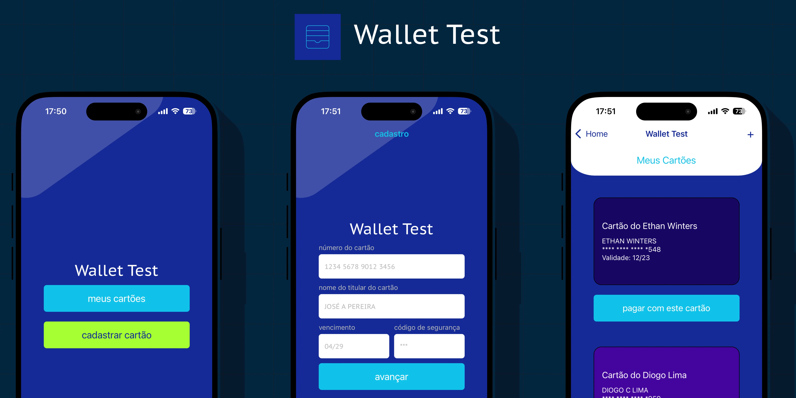

# WalletTest - VR (Case React Native)

Desafio técnico da vaga de React Native para a VR. Projeto base criado utilizando a ferramenta [`@react-native-community/cli`](https://github.com/react-native-community/cli).

## Funcionalidades

### Cadastro de Cartão de Crédito
- Permite o cadastro de cartão de crédito, com validação e máscara em todos os campos.
- Exibição de mensagens de erro em caso de problemas de conexão com o servidor.
- Exibição do card recém cadastrado em um componente que simula o layout de um cartão de crédito.

### Listagem de Cartão de Crédito
- Permite a escolha de um dos cartões para pagamento.
- Exibe uma lista animada de cartões de crédito disponíveis, permitindo a seleção de um deles.

## Tecnologias

React Native / TypeScript / React Navigation / React Native Reanimated / Jest

### Pré-requisitos:

- SDK do React Native configurado
- Android Studio e SDK do Android configurados para builds Android
- XCode, XCode Command Line Tools e Cocoapods configurados para builds iOS (*necessário um Mac)

### Execute o App

- Na raíz do projeto, instale as dependências com `npm install`.
- Caso pretenda gerar uma build iOS, execute `pod install` no diretório `ios`.
- Na raiz, execute `npm run android` para executar o app em um emulador ou dispositivo físico Android ou `npm run ios` para executar o app em um emulador ou dispositivo físico iOS.

### Inicie a API

- Caso esteja executando o app em um emulador, execute `npm run db` na raíz do projeto.
- Caso esteja executando o app em um dispositivo físico,
  - Conecte o computador e o dispositivo na mesma rede,
  - Edite os arquivos `package.json` e `CreditCardApi` e substitua `localhost` pelo IP da máquina na rede local onde o projeto será executado.
  - Execute `npm run db`.

### Testes
- Testes unitários podem ser executados com `npm run test`.
